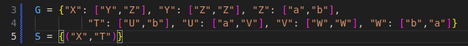

# Efficient algorithms for checking equivalence of compressed strings

We describe a polynomial time algorithm for the following problem:  
**The Problem:**  
Let G be a grammar which defines a set of words and S be a set of pairs of nonteminals from G.
Check if *wA* = *wB* for every pair (A, B) from S.  
Let G be a grammar with n productions which defines a set of words W.
Since the shortest words derivable from a nonterminal of a grammar in Chomsky normal form with n productions are of size not exceeding 2n the lengths of words from *W* are not longer than 2n. Such numbers can be stored in *n* bits.  
Standard algorithms for basic operations (comparing, addition, substraction,
division, multiplication) on such numbers work in polynomial time with respect to n.
This allows to compute the length of every word from *W* in polynomial time.

## Input
The algorithm gets two inputs,
- a set *G* containing two grammars that describe a word.  
        e.g. *G* = X → YZ, Y → ZZ, Z → ab,  
                   T → Ub, U → aV, V → WW, W → ba
- a set *S* of pairs of nonterminals from *G*.  
        *S* = {('X', 'T')}  
        At the begining, this set contains the two start nonterminals from both grammars.

Add the inputs inside the file `input.py` like so  

The algorithm then computes 
- a descending sorted list of nonterminals according to *`|w_A|`*,  ['X', 'T', 'U', 'Y', 'V', 'Z', 'W']
- the set of lengths |*w*| for each nonterminal, {'Z': 2, 'Y': 4, 'X': 6, 'W': 2, 'V': 4, 'U': 5, 'T': 6}

It further applies *`Split`* and *`Compact`* on rel, for every descending nonterminal.  
At the end, it checks if there exists any tripples *`(a,b,0)`* in *`rel`*, where *a!=b*.  
If that's the case it returns *`False`*, signifying that the two grammars in *`G`* produce different words.  
If not, the grammars are equal, and it returns *`True`*.

## Run

To run the programm, Make sure you have python3 installed. Here's a [download link](https://www.python.org/downloads/) if needed.  
Clone and open the repo locally.  
Execute the `app.py` file.  
A couple examples are present inside the `input.py` file. You can uncoment one at the time to run the programm. Just make sure to keep the same form (a set *G* with both grammars, and a set *S* witht the two initial nonterminals)  
