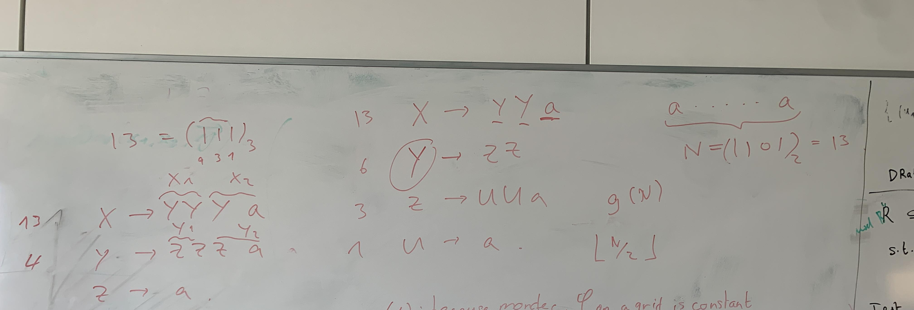

## TO-DO
Re-implement fib_prod_G1 and fib_prod_G2 to get two distinct CFGs representing Pi and Qi from "RePair Grammars are the Smallest Grammars for Fibonacci Words". also use the original algorithm to get another fib_prod_G0.  

## TESTING RUBRIQUE:
- rewrite the repair algorithm in python to generate the set of Productions.
- use the different variations to have two or more algorithms that produce distict grammars, like in Figure1 of the paper "RePair Grammars are the Smallest Grammars for Fibonacci Words".
- two types of tests. 
   - practical data and record duration.
   - Fibonacci words.
   - unary strings, e.g. A0 -> a, A1 -> A0 A0, ..., An -> An-1 An-1
   - compare the two representations of the word, in binary and in terrnary form. For example: 

- plot graph and see how the algorthm scales with respect to size, for each testing parameters